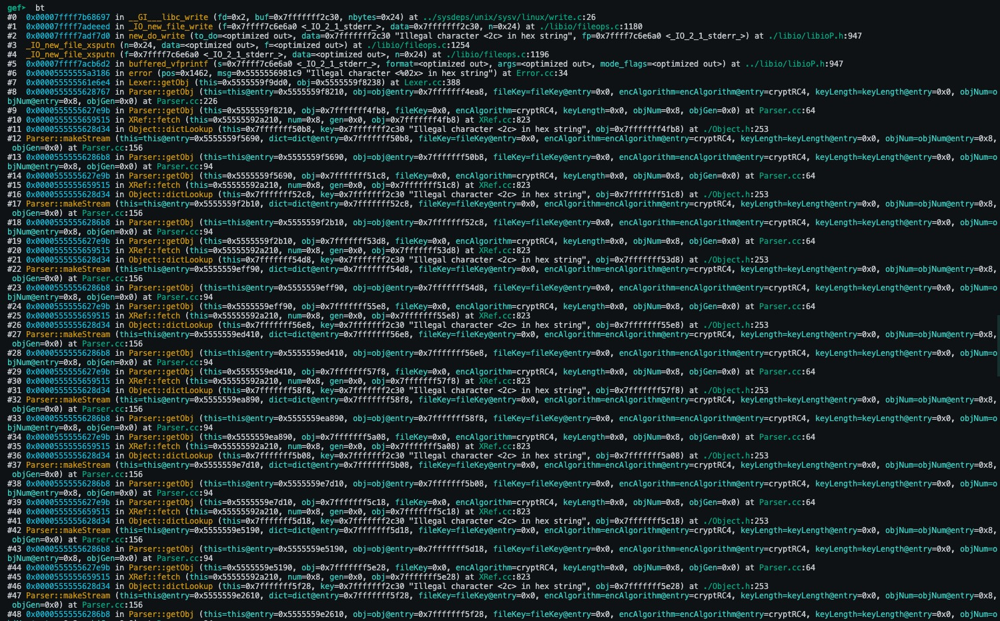

# CVE-2019-13288-POC

`xpdf/install/bin/pdftotext ./poc.pdf `

> In Xpdf 4.01.01, the Parser::getObj() function in Parser.cc may cause infinite recursion via a crafted file. A remote attacker can leverage this for a DoS attack. This is similar to CVE-2018-16646.

